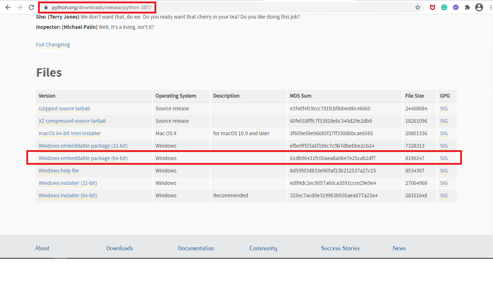
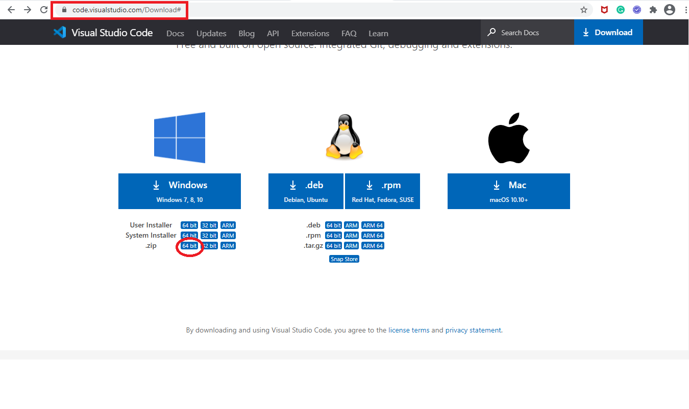
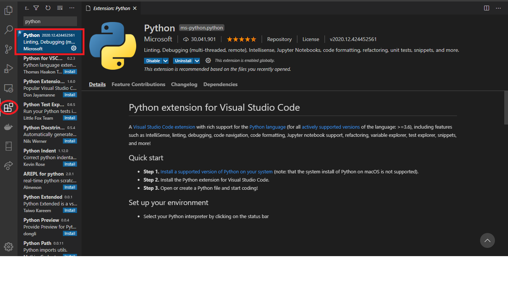
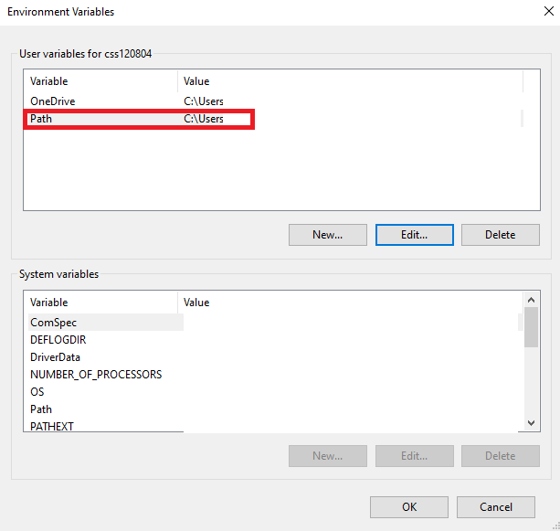
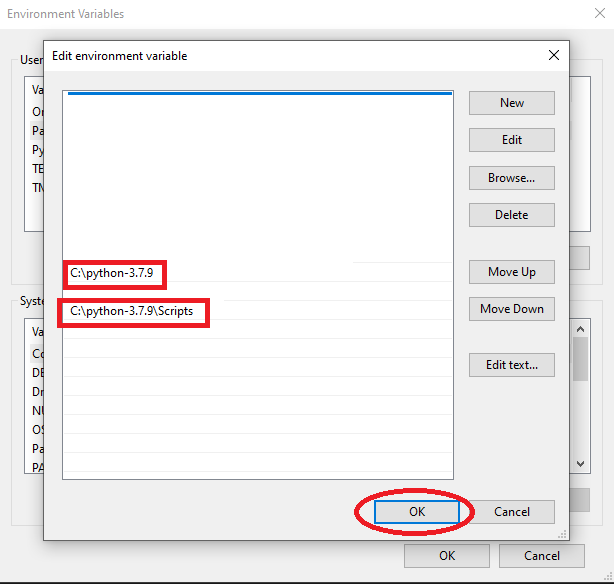

                          +-++-++-++-++-++-+ +-++-++-++-++-++-++-++-++-++-++-++-+ +-++-+ +-++-++-++-++-++-+
                          |p||y||t||h||o||n| |i||n||s||t||a||l||l||a||t||i||o||n| |o||n| |w||i||n||d||o||w|
                          +-++-++-++-++-++-+ +-++-++-++-++-++-++-++-++-++-++-++-+ +-++-+ +-++-++-++-++-++-+
# How to setup portable python on Window 10 (64-bit)?
> What need to download?
1. python
   Download portable python from following link [python 3.8.7](https://www.python.org/ftp/python/3.8.7/python-3.8.7-embed-amd64.zip). Python 3.8.7 is personal preferrence. You can download any embeddale python version.
   


2. VS Code 
   
   -  Visual Studio Code is a lightweight but powerful source code editor which runs on your desktop. Download the portable VS Code from this -   [link](https://code.visualstudio.com/Download#). [Check here](https://code.visualstudio.com/docs/introvideos/overview) to learn VS code.
   -  Install the Python extension for Visual Studio Code from market place.

> How to setup python?

To install it on your windows system, you just have to extract [it](https://www.python.org/ftp/python/3.8.7/python-3.8.7-embed-amd64.zip) on the folder that you want. For example, we extracted the files at `C:\python3`. Before using you need to add `C:\python3` in your environmental variables

| | |
|---|---|
|||

> How to Install Pip on Python?

-  VisualInstalling pip in your embedded python is easy. First, you just have to edit the python39._pth file inside your python directory. Then add Lib/site-packages on the top, then uncomment the import site
```python
Lib/site-packages
python37.zip
.

# Uncomment to run site.main() automatically
import site
```

-  After that, open up Terminal or CMD. Then browse to your python directory. Since in our example, our python directory is C:\python3, the command should look like:
      cd /d C:\python3

-  Once you’re inside the directory, we can now install the pip.
```
      curl https://bootstrap.pypa.io/get-pip.py -o get-pip.py
```
```
      python get-pip.py
```
-  To use pip, just use the following command in the terminal. 
```
      python -m pip install THE_MODULE_NAME
```

# Author
Ashish Kumar

# License
[](https://github.com/ashishcssom/How-to-set-up-python-on-Window-10/blob/main/LICENSE)
```
Copyright (c) 2020 Ashish Kumar
```

# Contact
[](https://www.linkedin.com/in/ashishk766/) 
[](mailto:ashish.krb7@gmail.com) 
